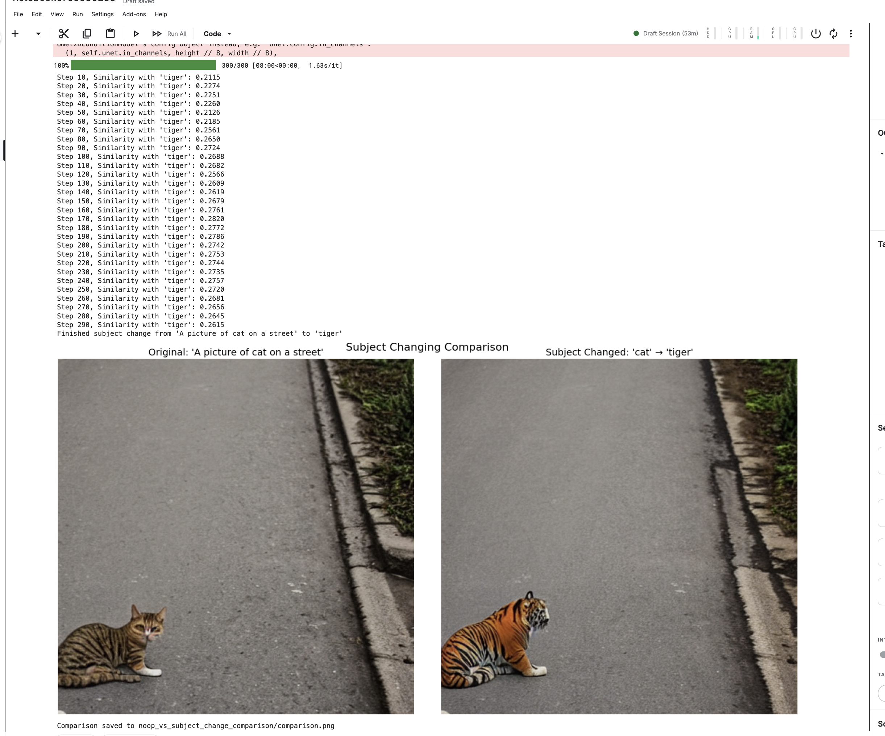

# Guided Diffusion with Custom Loss Functions

This project demonstrates how to use custom loss functions with Stable Diffusion to guide image generation. It includes implementations for:

1. **Edge Sharpening Loss** - Makes the edges in the generated image more defined and crisp
2. **Subject Changing Loss** - Gradually shifts the subject of an image to a different concept
3. **Blue Pixel Emphasis** - Increases blue components in the generated image

## Requirements

Install the required dependencies:

```bash
pip install torch torchvision torchaudio
pip install diffusers transformers accelerate
pip install Pillow numpy tqdm matplotlib
```

## Usage Options

### Jupyter Notebook (Recommended)

The easiest way to experiment with the guided diffusion techniques is to use the included notebook `guided_diffusion_colab.py`:

1. Open the notebook in your preferred environment (Google Colab, Jupyter, etc.)
2. Run the installation cell to set up dependencies
3. Use the interactive demo cells to generate images with different techniques:
   - Edge Sharpening Demo
   - Subject Changing Demo
   - Blue Pixel Emphasis Demo

### Command-line Interface

Alternatively, you can use the command-line interface:

```bash
# Generate an image with edge sharpening
python src/generate_images.py --prompt "Portrait of a woman wearing a red hat" --mode edge

# Generate an image with subject changing
python src/generate_images.py --prompt "A golden retriever" --mode subject --target_subject "wolf"

# Generate an image with blue emphasis
python src/generate_images.py --prompt "A sunset over mountains" --mode blue
```

### Command-line arguments

- `--prompt`: Text prompt for image generation
- `--mode`: Loss function to use: "edge", "subject", "blue", or "noop"
- `--target_subject`: Target subject for subject changing mode
- `--steps`: Number of diffusion steps (default: 50)
- `--scale`: Scale for the loss function (defaults depend on mode)
- `--output_dir`: Directory to save intermediate results
- `--seed`: Random seed for reproducibility (default: 42)
- `--model_id`: Hugging Face model ID to use (default: "runwayml/stable-diffusion-v1-5")

## Features

### Loss Functions

#### Edge Sharpening
The edge sharpening loss uses Sobel filters to detect edges and maximizes their magnitude. This encourages the diffusion process to generate images with more defined edges.

#### Subject Changing
The subject changing loss uses CLIP to compute the similarity between the generated image and text prompts. It implements several advanced techniques:
- **Concept Blending** - Uses multiple target prompts for richer guidance
- **Directional Guidance** - Pushes away from source subject toward target subject
- **Progressive Transformation** - Strength increases over time using a smooth curve
- **Attention Mapping** - Uses gradient-based attention to focus on relevant regions

#### Blue Pixel Emphasis
A simple example loss that promotes pixels with high blue channel values, resulting in images with a blue tint.

#### No-op Loss
A control function that follows the same computation path but doesn't meaningfully modify the image, used for comparison.

### Comparison Tools

The code includes specialized functions for direct visual comparison:

#### No-Op vs Edge Sharpening Comparison
Generates two images with identical seeds and settings - one with no guidance and one with edge sharpening. This allows you to see the exact impact of the edge sharpening loss on the final result.

#### No-Op vs Subject Changing Comparison
Generates two images with identical seeds and settings - one with no guidance and one with subject changing. This shows how the subject changing guidance transforms specific elements without altering the overall composition.

## Running Comparisons in the Notebook

### Edge Sharpening Comparison
Find the "Run No-Op vs Edge Sharpening Comparison" cell and configure:
- `prompt`: Your desired image prompt
- `sharpening_scale`: Strength of the edge sharpening effect
- `steps`: Number of diffusion steps
- `seed`: Random seed for reproducibility

## Generated Examples:

Guided scale is kept pretty high


Guided scale is kept relatively low
.png)

### Subject Changing Comparison
Find the "Run No-Op vs Subject Changing Comparison" cell and configure:
- `prompt`: Starting image prompt (e.g., "A golden retriever sitting in a garden")
- `target_subject`: What to transform the subject into (e.g., "wolf")
- `source_subject`: What to transform (leave blank for auto-detection)
- `steps`: Number of diffusion steps
- `subject_change_scale`: Strength of the transformation effect
- `step_size_factor`: How aggressive the gradient updates should be
- `seed`: Random seed for reproducibility

The comparison functions will generate both images side by side, save them to disk, and display them in the notebook for easy comparison.

## Generated Examples:
subject changing from cat to tiger
original prompt was A picture of cat on a street


This image not a comparison but it's impressive how the loss is nudging the image generation/ textual inversion into right direction. 
Just fascinating!!! (Should have trained for more steps)


## How It Works

This project uses the concept of classifier-free guidance combined with custom loss functions applied during the diffusion process:

1. At each diffusion step, we predict the denoised image (x0) based on the current noisy latents
2. We apply our custom loss function to this predicted image
3. We calculate the gradient of the loss with respect to the latents
4. We update the latents to reduce this loss, steering the generation process

## Customization

You can create your own custom loss functions by extending the `GuidedDiffusion` class. The notebook includes a template for creating custom loss functions with examples.

## Visualization Features

The project includes visualization tools for examining the generation process:
- Save intermediate steps to see the progression
- Animation tool to visualize the diffusion process
- Similarity plots for subject changing to track progress

## Advanced Subject Changing

The implementation includes advanced features for effective subject transformation:
- Multiple conceptually related target prompts
- Explicit pushing away from source subject features
- Adaptive guidance scaling based on diffusion progress
- Attention-based guidance focusing on specific image regions 